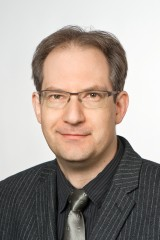
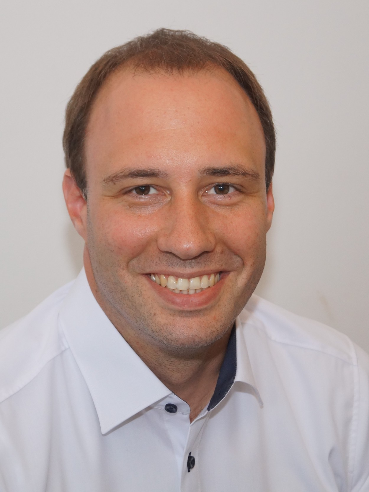
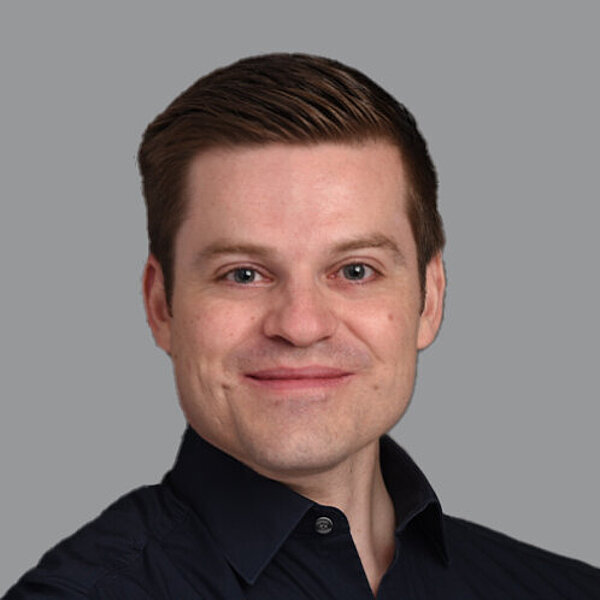
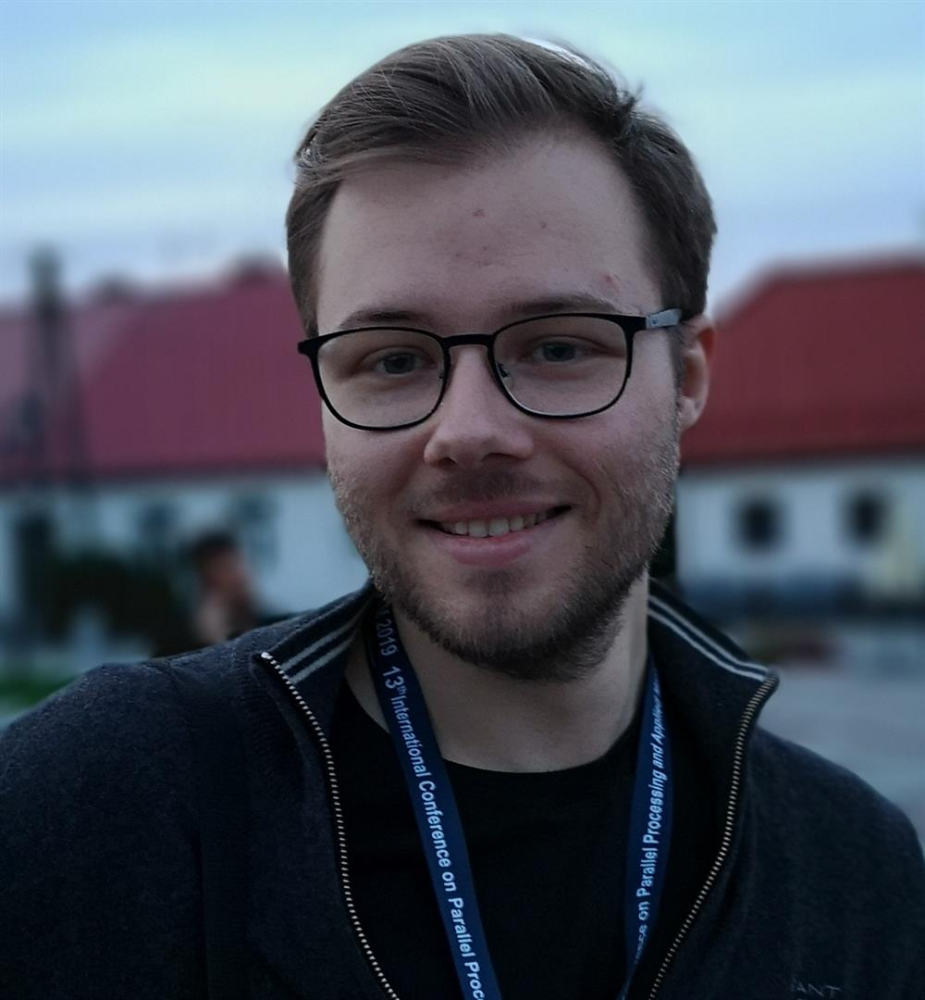
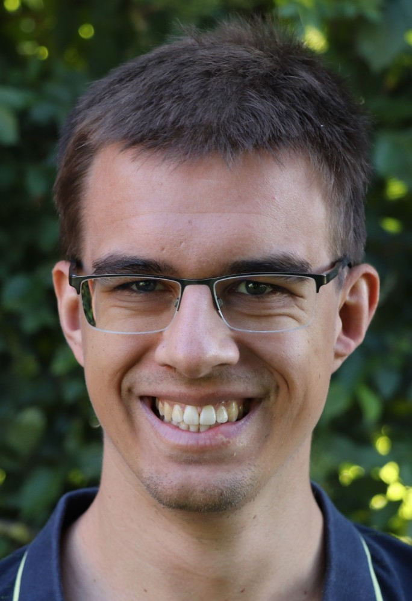
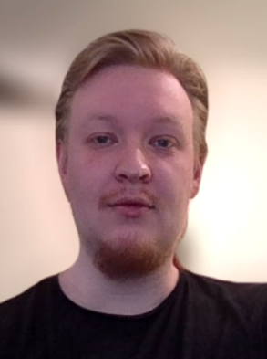

## Project Owner
### Univ.-Prof. Dr. Michael Bader

Add some description for the person.

## Project Leader
### Dr. Christian Terboven

Dr. Christian Terboven is a senior scientist and leads the HPC group at RWTH Aachen University. His research interests center around Parallel Programming and related Software Engineering aspects. Dr. Terboven has been involved in the Analysis, Tuning and Parallelization of several large-scale simulation codes for various architectures. He is responsible for several research projects in the area of programming models and approaches to improve the productivity and efficiency of modern HPC systems.

### Dr. Jose Gracia

Together with his research group, José Gracia works on topics around scalable programming models and tools. This includes, in particular, new approaches for MPI and task-based programming models and their interoperability. Furthermore, he works on tools for performance analysis, characterisation of application performance and optimisation of scientific codes and workflows.

He holds a PhD in physics with a focus in numerical simulation of astrophysical flows.

## Project Members
### Christian Siebert

Christian Siebert studied computer science and specialised in high-performance computing. He then worked for NEC's Research Lab in the HPC team and further developed their proprietary MPI implementation. He was also actively involved in MPI standardisation, e.g. non-blocking collective MPI operations.

At RWTH Aachen he lectured on parallel programming and concentrated on the development of new scalable algorithms, e.g. for sorting and shuffling. At HHU Düsseldorf, he provided HPC user support and also led the nationwide effort in this area.

At HLRS, Siebert is preparing applications for the exascale era.

### Lukas Krenz

Add some description for the person.

### David Scheller

Add some description for the person.

### Adrian Schmitz

Adrian Schmitz finished his masters degree in computer science in 2021 at the RWTH. Afterwards he joined the group for high-performance computing at the RWTH Aachen, where he continues to work on global optimizations for heterogeneous cluster systems with multiple nodes and GPUs. 

